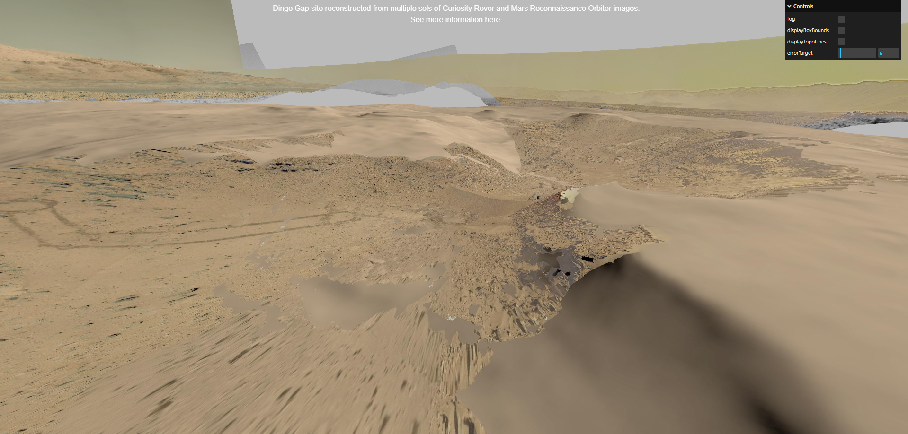
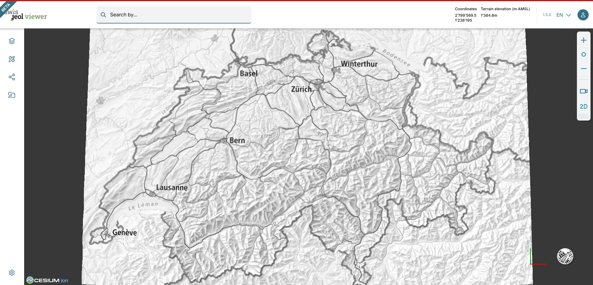

# CesiumJS Resources

lists of links of CesiumJS related resources.

## Official Site

https://cesium.com/

## Official API Document

https://cesium.com/docs/cesiumjs-ref-doc/

## Official Examples

https://sandcastle.cesium.com/

## Source Repository

https://github.com/CesiumGS/cesium

## Technical Documents

https://github.com/CesiumGS/quantized-mesh  
https://github.com/CesiumGS/3d-tiles

## Terrain

| Link                                                                           | Star |
| ------------------------------------------------------------------------------ | ---- |
| https://github.com/geo-data/cesium-terrain-builder                             | 811  |
| https://github.com/kaktus40/Cesium-GeoserverTerrainProvider                    | 371  |
| https://github.com/geo-data/cesium-terrain-server                              | 293  |
| https://github.com/ahuarte47/cesium-terrain-builder/tree/master-quantized-mesh | 241  |
| https://github.com/heremaps/quantized-mesh-viewer                              | 192  |
| https://github.com/giohappy/gdal2cesium                                        | 89   |
| https://github.com/xlhomme/WCSTerrainProvider                                  | 26   |
| https://github.com/TNOCS/mbtiles-terrain-server                                | 5    |

## 3DTiles

| Link                                                    | Star |
| ------------------------------------------------------- | ---- |
| https://github.com/fanvanzh/3dtiles                     | 2.1k |
| https://github.com/PrincessGod/objTo3d-tiles            | 822  |
| https://github.com/scially/Cesium3DTilesConverter       | 457  |
| https://github.com/CesiumGS/3d-tiles-validator          | 447  |
| https://github.com/CesiumGS/3d-tiles-tools              | 425  |
| https://github.com/Geodan/pg2b3dm                       | 406  |
| https://github.com/OpenDroneMap/Obj2Tiles               | 283  |
| https://github.com/mfbonfigli/gocesiumtiler             | 252  |
| https://github.com/Oslandia/py3dtilers                  | 236  |
| https://github.com/Oslandia/py3dtiles                   | 223  |
| https://github.com/mattshax/cesium_pnt_generator        | 194  |
| https://github.com/tum-gis/cesium-point-cloud-generator | 186  |
| https://github.com/nxddsnc/gltf-to-3dtiles              | 176  |
| https://github.com/xuzhusheng/gltf-to-3d-tiles          | 164  |
| https://github.com/daniel-hilton/gltf-b3dm-convertor    | 37   |
| https://github.com/Construkted-Reality/3DTG             | 23   |
| https://github.com/saharilarshad/gltf-to-3dtiles        | 3    |
| https://github.com/saharilarshad/citygml-to-3dtiles     | 1    |

## Open Source Examples

| Link                                                             | Accessed | Star | Screenshot                                                               |
| ---------------------------------------------------------------- | -------- | ---- | ------------------------------------------------------------------------ |
| https://github.com/NASA-AMMOS/3DTilesRendererJS                  | Aug 2025 | 2k   |     |
| https://github.com/TerriaJS/terriajs                             | Aug 2025 | 1.3k |                                    |
| https://github.com/MikesWei/CesiumMeshVisualizer                 | Aug 2025 | 741  |                                                                          |
| https://github.com/zhangti0708/cesium-examples                   | Aug 2025 | 657  |                                                                          |
| https://github.com/CesiumChina/cesium-map                        | Aug 2025 | 630  |                                                                          |
| https://github.com/RaymanNg/3D-Wind-Field                        | Aug 2025 | 461  |                                                                          |
| https://github.com/MikesWei/CesiumVectorTile                     | Aug 2025 | 437  |                                                                          |
| https://github.com/3dcitydb/3dcitydb-web-map                     | Aug 2025 | 395  |                                                                          |
| https://github.com/zhengjie9510/webgis-demo                      | Aug 2025 | 325  |                                                                          |
| https://github.com/Flowm/satvis                                  | Aug 2025 | 325  |                                                                          |
| https://github.com/xtfge/cesium-draw                             | Aug 2025 | 315  |                                                                          |
| https://github.com/alberto-acevedo/cesium-navigation             | Aug 2025 | 313  |                                                                          |
| https://github.com/hongfaqiu/cesium-extends                      | Aug 2025 | 310  |                                                                          |
| https://github.com/leforthomas/cesium-drawhelper                 | Aug 2025 | 210  |                                                                          |
| https://github.com/MapGIS/WebClient-JavaScript                   | Aug 2025 | 182  |     |
| https://github.com/NichijouCC/cesium_demos                       | Aug 2025 | 164  |                                                                          |
| https://github.com/manuelnas/CesiumHeatmap                       | Aug 2025 | 163  |     |
| https://github.com/adventureXPH/drawForCesium                    | Aug 2025 | 139  |                                                                          |
| https://github.com/NICTA/cesium-vr                               | Aug 2025 | 83   |                                                                          |
| https://github.com/3DGISKing/CesiumJsSamples                     | Aug 2025 | 68   |                                                                          |
| https://github.com/KhaledSharif/cesium-satellites                | Aug 2025 | 66   |                                                                          |
| https://github.com/AlbertEjiestein/Wind-Field-Cesium             | Aug 2025 | 61   |                                                                          |
| https://github.com/ElevenIjusee/CesiumContextMenu                | Aug 2025 | 51   |                                                                          |
| https://github.com/swisstopo/swissgeol-viewer-suite              | Aug 2025 | 39   |  |
| https://github.com/3DGISKing/CesiumJsTerrainCutVolumeMeasurer    | Aug 2025 | 48   |                                                                          |
| https://github.com/EndPointCorp/cesium-kml-czml-editor           | Aug 2025 | 39   |                                                                          |
| https://github.com/3DGISKing/CesiumJsFirstPersonCameraController | Aug 2025 | 37   |                                                                          |
| https://github.com/3DGISKing/CesiumJs3DTileServer                | Aug 2025 | 31   |                                                                          |
| https://github.com/pasu/ExamplesforCesium                        | Aug 2025 | 15   |                                                                          |

### Applications

https://app.4dmapper.com/app/projects  
https://app.luucy.ch/  
https://app.luucy.ch/Celerina_digial_Celerina/projects  
https://cici.lab.asu.edu/polarglobe/  
https://cloud.skylineglobe.com/SG/terraexplorerweb/terraexplorer.html?catalogid=CloudDemo_TE4W&site=demos  
https://lasp.colorado.edu/maven/sdc/public/pages/maven3d/  
https://map.geo.admin.ch  
https://maris.iaea.org/explore/type/1  
https://panevezys.lt/3d/  
https://replay.flights/  
https://radio.garden/  
https://skylineglobe.com/sg/TerraExplorerweb/  
https://spaceaware.io/  
https://wayfinder.privateer.com/  
https://www.3drotterdam.nl/#/  
https://www.pointerra.com/  
https://www.virtualcitymap.de/

## Cesium based SDKs

http://mars3d.cn/example.html  
https://dc.dvgis.cn/#/examples  
http://www.converse3d.com/

## Materials

https://github.com/YanzheZhang/Cesium.HPUZYZ.Demo  
https://github.com/hujiulin/CesiumJS-tutorial  
https://github.com/ZhiminXu/AwesomeCesium
https://github.com/AJJackGIS/learning_cesium
